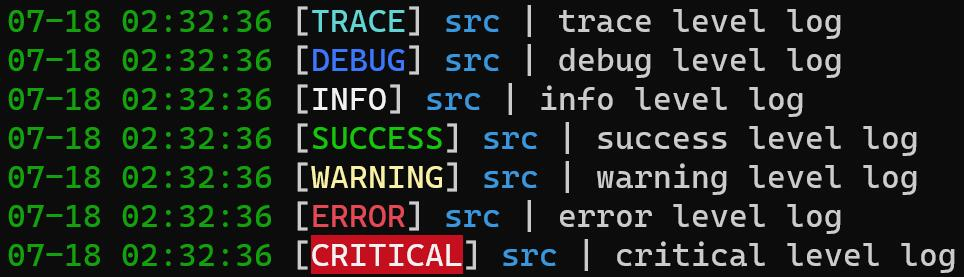

# 优化日志

在我们开发的过程中，难免会遇到需要在后台获取某些信息来辅助开发或排查故障的情况，例如用户信息、返回值或其他相关信息。虽然我们可以使用 `print` 来将这些信息输出到控制台，但这些信息相对于NoneBot2 框架本身和其他优秀的插件所提供的日志来说并不美观，也没有其他辅助信息（例如事件、内容高亮、插件名等）。而实现这种日志效果的方法非常简单——[Loguru](https://loguru.readthedocs.io/)。

NoneBot2 使用 `Loguru` 进行日志记录。我们可以通过一行代码即可输出不同 `log level` 的日志，例如：

```python
from nonebot.log import logger

# Log with corresponding severity.
logger.trace('trace level log')
logger.debug('debug level log')
logger.info('info level log')
logger.success('success level log')
logger.warning('warning level log')
logger.error('error level log')
logger.critical('critical level log')
```

输出的日志为依次为：

```log
07-18 02:32:36 [TRACE] src | trace level log
07-18 02:32:36 [DEBUG] src | debug level log
07-18 02:32:36 [INFO] src | info level log
07-18 02:32:36 [SUCCESS] src | success level log
07-18 02:32:36 [WARNING] src | warning level log
07-18 02:32:36 [ERROR] src | error level log
07-18 02:32:36 [CRITICAL] src | critical level log
```

在 [Windows Terminal](https://github.com/microsoft/terminal) 中的效果为:


在机器人的配置项中，我们也可以通过 `LOG_LEVEL=` 来配置[日志等级](https://loguru.readthedocs.io/en/stable/api/logger.html#loguru._logger.Logger)，在控制台中仅会输出大于等于日志等级的日志，忽略掉低于日志等级的日志。默认的 `LOG_LEVEL` 为 `INFO`。

<!-- TODO: 补充配置项的链接 -->

在 NoneBot2 中，用户可以自定义日志的格式。此部分将在将会在 ***（进阶部分的对应内容）*** 中进行介绍。

<!-- TODO: 补充进阶内容的链接 -->
